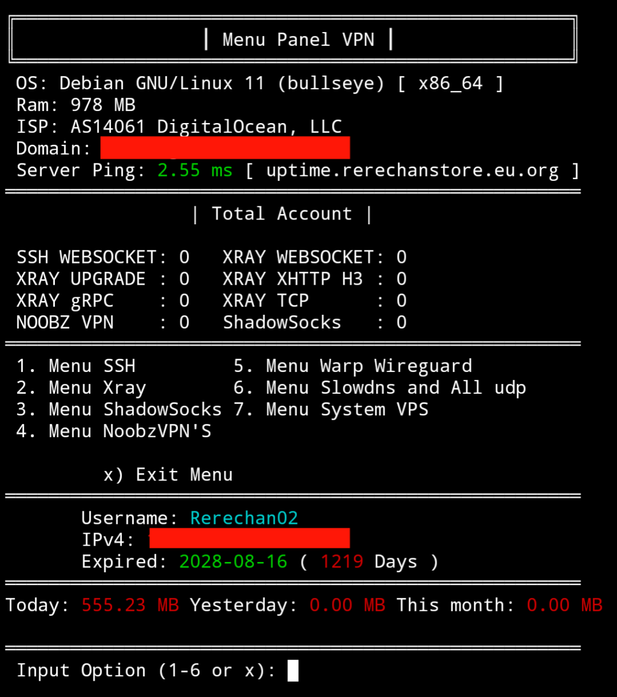

# Auto Script VPN

## Docs Index

> [**Docs Index**](#Docs-Index)

> [**About**](#About)

> [**Install**](#Install)

> [**Configuration System**](#System-Configuration)

- [Feature](#Feature)
- [System Requirements](#System-Requirements)
- [Port List](#Port-List)
- [Path List](#Path-List)
- [ALPN List](#Alpn)

> [**Demo Menu**](#Menu)

> [**Subscription**](#Subscription)

> [**Support**](#Support)

## About
Autoscript AIO (All-In-One) is an automation script designed to simplify the installation and configuration of essential services on a VPS server, mainly for VPN, tunneling, and proxy use. This script is suitable for both beginners and advanced users who want to quickly and efficiently deploy a secure server without having to set up everything manually.
The script supports a variety of popular protocols such as VMess, VLESS, Trojan, SSH, and SlowDNS, along with integration for WebSocket, gRPC, and TLS. It also includes features for user monitoring, account management, bandwidth quotas, and an auto backup system.
With an All-In-One approach, users can run a single script to set up all necessary services, saving time and effort when managing a VPN or proxy server.
Perfect for VPN providers

## Install

### Tahap 1
```shell
apt update ; apt install curl wget tmux gnupg -y
```

### Tahap 2
- Buy DM [Rerechan02](https://t.me/Rerechan02)

## System Configuration

## Feature
---
| Feature                                                     | Feature                                                      |
|-------------------------------------------------------------|--------------------------------------------------------------|
| Cloudflare SSL                                              | All CDN Support                                              |
| Full CLI Dashboard                                          | Multi Port Multi Protocol                                    |
| Load Balance [`80`/`443`] (Modular: Enabled)               | SSH Limit Login (Disconnect Last Session Only)              |
| Routing [`V2ray`/`XRay`] (Modular: Disabled)               | ON / OFF Service Menu                                       |
| Run Services Based on Existing Account                      | Bypass Traffic Proxy & Anonymous Proxy                       |
| Telegram Bot Notification                                   | Admin Menu for Granting Root Access                          |
| Limit Device & Quota [`XRay`/`NoobzVPN`/`SSH`]              | Uninstall or Rebuild VPS Menu [`select OS`]                 |
| Auto Expired Account [`All Protocol`]                       | Detailed Usage Quota / Bandwidth Info                        |
| Client Details & Expired Script Info                        | Argo Tunnel Cloudflare Multi Server [`SSH`/`XRAY`] (Disabled)|
| Change Server Timezone                                      | Change Dropbear Banner Menu                                  |
| List Total Accounts, OS Details & VPS Provider Info         | Change Dropbear Version Menu                                 |
| Full Admin Access Control                                   | Backup & Restore Feature                                     |
| Custom & Modify UUID/Password for Xray/V2ray                | Recover Expired Xray/V2ray Account                           |
| Auto Notification on Account Creation                       | Bulk Xray Account Creation Menu                              |
---

## System Requirements

### Debian

| Version   | Status                                         | Code       |
|-----------|------------------------------------------------|------------|
| Debian 9  | <span style="color:white;background:#d9534f;padding:2px 6px;border-radius:4px">Not Support</span> | stretch    |
| Debian 10 | <span style="color:white;background:#d9534f;padding:2px 6px;border-radius:4px">Not Support</span> | buster     |
| Debian 11 | <span style="color:white;background:#5cb85c;padding:2px 6px;border-radius:4px">Stable</span>      | bullseye   |
| Debian 12 | <span style="color:white;background:#5cb85c;padding:2px 6px;border-radius:4px">Stable</span>      | bookworm   |
| Debian 13 | <span style="color:black;background:#f0ad4e;padding:2px 6px;border-radius:4px">Not Tested</span>  | trixie     |

### Ubuntu

| Version         | Status                                         | Code     |
|------------------|------------------------------------------------|----------|
| Ubuntu 18.04 LTS | <span style="color:white;background:#d9534f;padding:2px 6px;border-radius:4px">Not Support</span> | bionic   |
| Ubuntu 20.04 LTS | <span style="color:white;background:#5cb85c;padding:2px 6px;border-radius:4px">Stable</span>      | focal    |
| Ubuntu 22.04 LTS | <span style="color:white;background:#5cb85c;padding:2px 6px;border-radius:4px">Stable</span>      | jammy    |
| Ubuntu 23.04 LTS | <span style="color:white;background:#5cb85c;padding:2px 6px;border-radius:4px">Stable</span>      | lunar    |
| Ubuntu 24.04 LTS | <span style="color:white;background:#5cb85c;padding:2px 6px;border-radius:4px">Stable</span>      | noble    |

### Kali Linux

| Version      | Status                                         | Code          |
|--------------|------------------------------------------------|---------------|
| Kali Rolling | <span style="color:black;background:#f0ad4e;padding:2px 6px;border-radius:4px">Not Tested</span>  | kali-rolling  |

### Other

| Version | Status                                     | Code |
|---------|--------------------------------------------|------|
| Soon    | <span style="color:white;background:#5bc0de;padding:2px 6px;border-radius:4px">Soon</span> | soon |

## Port List
---
| Service               | Port                                           |
|------------------------|------------------------------------------------|
| OpenSSH               | 22, 443, 3303, 2053, 80, 777                   |
| Dropbear              | 22, 443, 2053, 109, 111, 80, 777               |
| UDP Custom            | 1-65535                                        |
| UDP Request           | 1-65535                                        |
| BadVPN/UDPGW          | 7100 - 7900                                    |
| HTTP Proxy & Squid    | 3128 (Limit Access)                            |
| Open HTTP Puncher     | 8181, 8282, 8383                               |
| Socks5 Proxy          | 1080                                           |
| SSH SlowDNS / DNSTT  | 5300, 443, 80, 2053                            |
| SSH TLS/SNI       | 443, 8443, 8999, 9443, 9755, 400-777           |
| HTTP WebSocket        | 80-108, 2082, 8000, 8080-8180, 2084-2199       |
| HTTP(S) WebSocket       | 443, 8443, 8999, 9443, 9755, 400-777           |
| WebSocker Enhanced      | 2080, 2082, 8080, 80, 443, 8443        |
| OpenVPN TCP           | 1194                                           |
| OpenVPN UDP           | 2200                                           |
| OpenVPN SlowDNS       | 25000                                          |
| OpenVPN OHP           | 8181, 8282, 8383                               |
| OpenVPN TLS/SNI       | 443, 8443, 8999, 9443, 9755, 400-777           |
| Xray TCP              | 2083                                           |
| Xray SlowDNS          | 5300                                           |
| Xray HTTP        | 80-108, 2082, 8000, 8080-8180, 2084-2199       |
| Xray HTTP(S)    | 443, 8443, 8999, 9443, 9755, 400-777           |
| NoobzVPN TLS/SNI      | 443, 8443, 8999, 9443, 9755, 400-777           |
| NoobzVPN HTTP    | 80-108, 2082, 8000, 8080-8180, 2084-2199       |
| NoobzVPN HTTP(S)     | 443, 8443, 8999, 9443, 9755, 400-777           |
| ShadowSocks TLS       | 2443 (+1)                                      |
| ShadowSocks HTTP      | 3443 (+1)                                      |
| Hysteria1             | Random                                         |
| Hysteria2             | Random                                         |
| SlowUDP               | Random                                         |
| Wireguard (WARP)      | 51820                                          |
| Argo Tunnel HTTP      | 80, 8080, 8880, 2052, 2082, 2086, 2095         |
| Argo Tunnel HTTP(S)    | 443, 2053, 2083, 2087, 2096, 8443              |
---

## Path List
---
| Service         | Path 1         | Path 2         | Path 3         | Path 4        |
|-----------------|----------------|----------------|----------------|---------------|
| SSH             | `/`            | `/custom`      | `/whatever`    | `/ssh`        |
| OpenVPN         | `/`            | `/custom`      | `/whatever`    | `/noobz`    |
| NoobzVPN        | `/`            | `/custom`      | `/whatever`    | `none`        |
| VMess WS        | `/vmessws`     | `/worryfree`   | `/kuota-habis` |               |
| VLESS WS        | `/vlessws`     |                |                |               |
| Trojan WS       | `/trojanws`    |                |                |               |
| VMess HTTP Upgrade        | `/vmess-hu`    |                |                |               |
| VLESS HTTP Upgrade        | `/vless-hu`    |                |                |               |
| Trojan HTTP Upgrade       | `/trojan-hu`   |                |                |               |
| Trojan TCP      | `/`            | `-`            |      |         |
| VMess gRPC      | `vmess-grpc`  | `/vmess-grpc`   |                |               |
| VLESS gRPC      | `vless-grpc`  | `/vless-grpc`   |                |               |
| Trojan gRPC     | `trojan-grpc` | `/trojan-grpc`  |                |               |
| VMess XHTTP     | `/xhttpvm`     | `xhttpvm`      | `/xhttpvm/`    |               |
| VLESS XHTTP     | `/xhttpvl`     | `xhttpvl`      | `/xhttpvl/`    |               |
| Trojan XHTTP    | `/xhttptr`     | `xhttptr`      | `/xhttptr/`    |               |
| ShadowSocks     | `/`            | `none`         |                |               |
| UDP Custom      | `/`            | `none`         | `-`            |               |
| UDP Request     | `/`            | `none`         | `-`            |               |
| Hysteria1       | `/`            | `none`         | `-`            |               |
| Hysteria2       | `/`            | `none`         | `-`            |               |
| SlowUDP         | `/`            | `none`         | `-`            |               |
| WireGuard  (WARP)   | `/`            | `none`         | `-`            |               |
---
Detail: All Paths Support dynamic Path example: `/ssh` can be `whatever/ssh/whatever` and still connect as long as the word `/ssh` is there.

## ALPN
---
| Protocol   | Description                |
|------------|----------------------------|
| HTTP/1.1   | Standard HTTP              |
| h2         | HTTP/2 (Multiplexing)      |
| h3         | HTTP/3 (QUIC-based)        |
---

## Menu


## Subscription
---
| Deskripsi (ID) | Description (EN) |
|----------------|------------------|
| Proses pembelian dilakukan melalui [Rerechan02](https://t.me/Rerechan02) | Purchase is made through [Rerechan02](https://t.me/Rerechan02) |
| Pembelian pertama: Rp. 15.000 / $1 per IP [30 Hari Aktif] | First purchase: Rp. 15,000 / $1 per IP [30 Days Active] |
| Perpanjangan: Rp. 10.000 / IP [Setiap 30 Hari Aktif] | Renewal: Rp. 10,000 / IP [Every 30 Days Active] |
| Proses resolv IP sekitar 5–10 menit | IP resolving takes around 5–10 minutes |
| Pengujian koneksi gunakan jaringan normal (bukan metode tunneling) | Use a normal internet connection for testing (not via tunneling/method) |
| Tanggung jawab admin sebatas fitur/layanan tertulis | Admin is only responsible for the listed features/services |
| Suspend server karena pelarangan VPN oleh provider bukan tanggung jawab admin | Suspended servers due to VPN restrictions by provider are not admin’s responsibility |
| Pelanggan dianggap setuju dengan semua ketentuan di atas | Customers are considered to agree with all terms above |
| Tidak ada refund setelah transaksi berhasil | No refund after a successful transaction |
---

## Support

Please join the following Telegram groups and channels to get information about Patches or things related to improving script functions.
- Telegram : [Rerechan02](https://t.me/Rerechan02)
- Telegram Channel : [FN Project](https://t.me/fn_project)